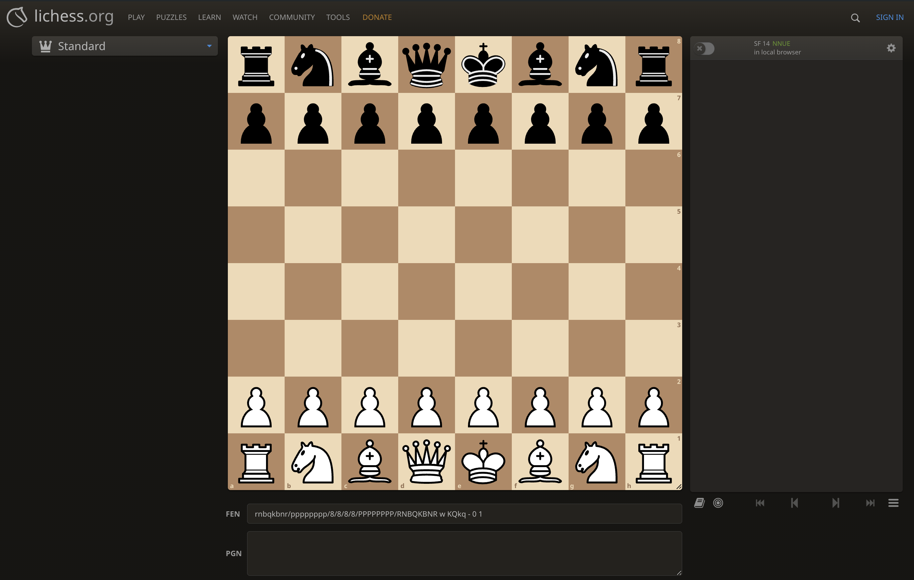

# Chess Puzzle

This is a simple chess puzzle game designed to demonstrate interoperability between Solidity and Rust, brought to life by the awesome Fluent project. The goal is to solve the puzzle in one move.

Project Structure
The project consists of two main parts:

- `puzzle`: Solidity smart contracts that describe the main logic of the game.
- `checkmate-validator`: Rust library that allows finding the solution for the given board position and move.

## How to run the project?

**1. Deploy checkmate-validator contract:**

```bash
cd checkmate-validator
make deploy
```

**2. Deploy the puzzle contract:**

```bash
cd puzzle
npm run deploy
```

**3. Let's start a game:**

```bash
npm run new-game
```

## How to generate new puzzle?

You can use amazing [lichess.org](https://lichess.org/analysis/standard) to generate the puzzle.



You need to create a puzzle which can be solved in 1 move.

For example you can use the following position in [FEN format](https://en.wikipedia.org/wiki/Forsyth%E2%80%93Edwards_Notation):

- `r1bqkbnr/ppp2ppp/2np4/4p2Q/2B1P3/8/PPPP1PPP/RNB1K1NR w KQkq - 0 4` [lichess link](https://lichess.org/analysis/standard/r1bqkbnr/ppp2ppp/2np4/4p2Q/2B1P3/8/PPPP1PPP/RNB1K1NR_w_KQkq_-_0_4)

The solution is `Qxf7#` - the queen takes the pawn on f7 and it's a checkmate.
